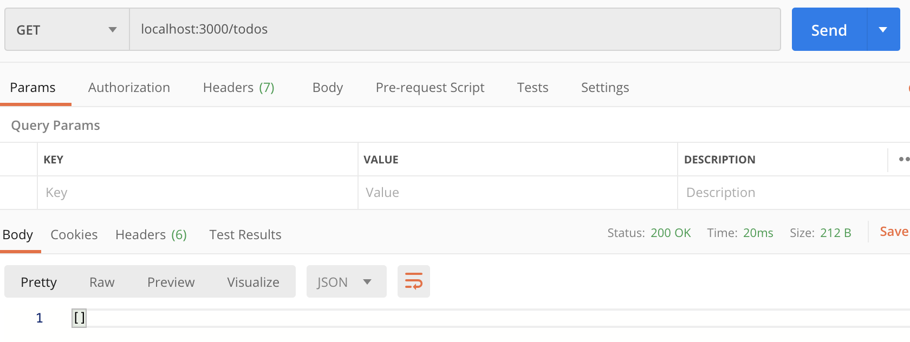
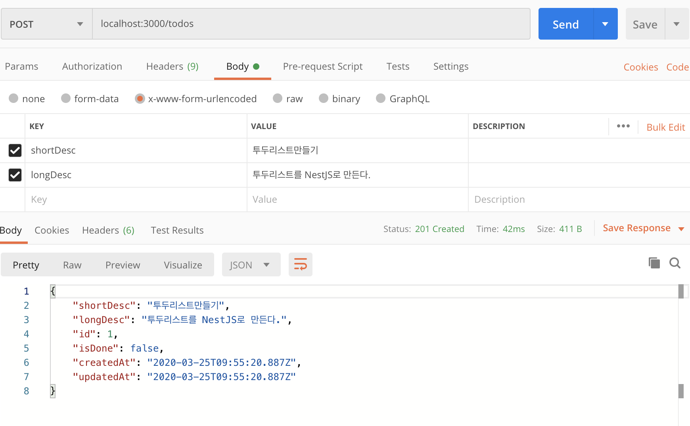
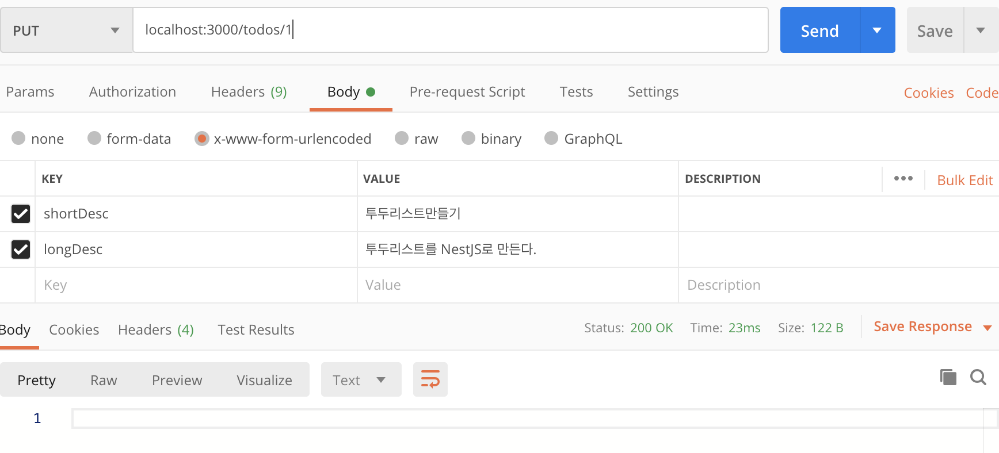
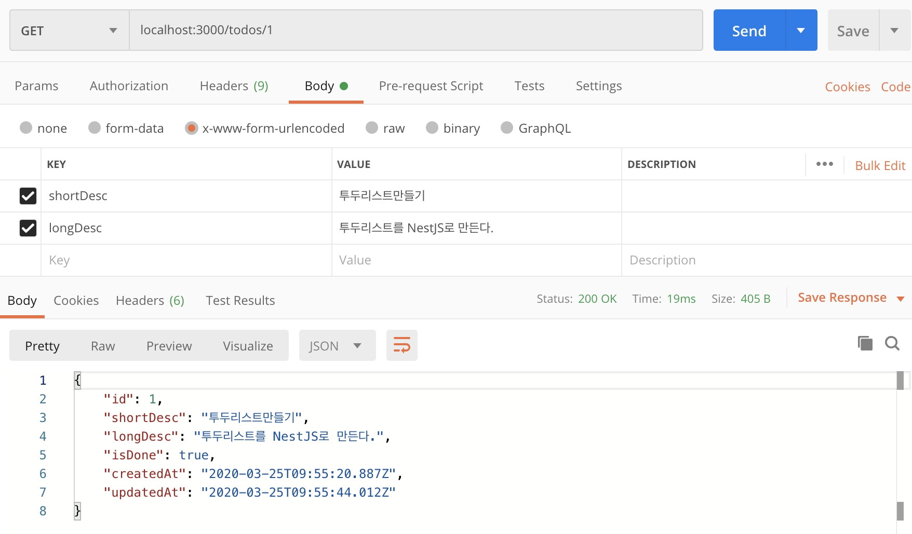
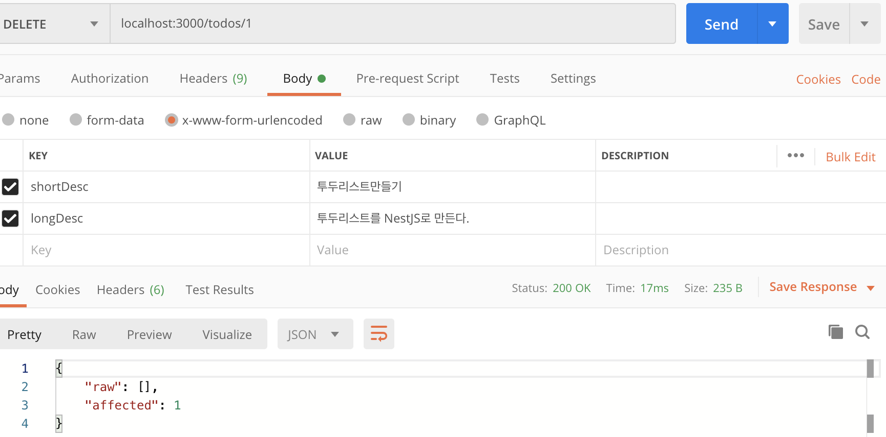

우선 빠르게 배워봤으니 Nest와 TypeORM을 사용해서 국민 데모 앱 TODO API를 만들어보자. 앤드포인트는 아래와 같이 설계할 생각이다.

- `GET /todos`: 투두 리스트
- `POST /todos`: 투두 만들기
- `GET /todos/:id`: 투두 디테일 데이터 가져오기
- `PUT /todos/:id`: 투두 디테일 상태 변경 (완료, 미완료)
- `DELETE /todos/:id`: 투두 삭제

## TypeORM 붙이기

먼저 프로젝트를 시작해보자. 아래 명령어로 간단하게 공식적으로 제공해주는 보일러플레이트를 사용할 수 있다.

`npx @nestjs/cli new nest-todo-api-demo`

TypeORM을 붙이기 위해서 [이 링크](https://docs.nestjs.com/recipes/sql-typeorm)와 이 [링크](https://docs.nestjs.com/techniques/database)를 참조했다.

먼저 필요한 데이터베이스 세팅을 해줬다. `docker-compose.yml`로 PostgreSQL과 pgAdmin을 띄우고 데이터베이스도 만들어줬다. 그 다음 필요한 패키지를 인스톨 해줬다.

```bash
yarn add @nestjs/typeorm typeorm pg
```

투두 데이터는 아래처럼 설계했다.

```ts
// src/models/todo.entity.ts

import {
  BaseEntity,
  PrimaryGeneratedColumn,
  Entity,
  Column,
  CreateDateColumn,
  UpdateDateColumn,
} from 'typeorm';

@Entity()
class Todo extends BaseEntity {
  @PrimaryGeneratedColumn()
  id: number;

  @Column({ type: 'varchar', length: 50 })
  shortDesc: string;

  @Column({ type: 'varchar', nullable: true })
  longDesc?: string;

  @Column({ type: 'boolean', default: false })
  isDone: boolean;

  @CreateDateColumn()
  createdAt: Date;

  @UpdateDateColumn()
  updatedAt: Date;
}

export default Todo;
```

이후, `app.module.ts`에 `TypeOrmModule`을 임포트 시켰다.

```ts
// src/app.module.ts

import { Module } from '@nestjs/common';
import { TypeOrmModule } from '@nestjs/typeorm';
import Todo from './models/todo.entity.ts';

@Module({
  imports: [
    TypeOrmModule.forRoot({
      type: 'mysql',
      host: 'localhost',
      port: 5432,
      username: 'postgres',
      password: 'postgres',
      database: 'todo-database',
      entities: [Todo],
      synchronize: true,
    }),
  ],
})
export class AppModule {}
```

`forRoot()` 메서드는 `createConnection()` 함수에 들어가게 되는 설정 값을 넣어줄 수가 있다. 게다가 몇 가지 추가적인 설정 값이 있는데, 아래와 같다.

- `retryAttempts`: database 연결 시도 횟수 (기본 10)
- `retryDelay`: 연결 시도 사이 딜레이 (기본 3000ms, 3초)
- `autoLoadEntities`: `true`인 경우, 엔티티들이 자동으로 불러와짐 (기본 `false`)
- `keepConnectionAlive`: `true`인 경우, 연결이 앱이 꺼져도 유지됨 (기본 `false`)

> 엔티티들을 자동으로 불러오지 않는 다는 건 무슨 말일까? 자동으로 불러오는 것이 기본이 아닌 이유는 뭘까?

express에서 TypeORM을 사용하듯, 프로젝트 최상단에 `ormconfig.json`을 두고, `forRoot()` 메서드에 옵션을 안 넘겨도 된다.

위처럼 연결해주는 작업을 하고 나면, TypeORM `Connection`과 `EntityManager` 객체는 전체 프로젝트에서 주입 가능해진다.

## Todo 모듈 만들어주기

모듈별로 구분해주고 싶으니까 `src/modules/todo` 디렉토리를 만들고 이 안에서 만들어보려고 한다. 우선 `todo.controller.ts`와 `src/modules/todo/todo.service.ts`를 만들었고, `src/modules/todo/interfaces/dto.interface.ts`도 만들었다.

```ts
// src/modules/todo/interfaces/dto.interface.ts

export interface ICreateTodoDto {
  shortDesc: string;
  longDesc?: string;
}
```

```ts
// src/modules/todo/todo.service.ts

import { Injectable } from '@nestjs/common';
import Todo from 'src/models/todo.entity';
import { ICreateTodoDto } from './interfaces/dto.interface';
import { Repository } from 'typeorm';
import { InjectRepository } from '@nestjs/typeorm';

@Injectable()
export class TodoService {
  constructor(
    @InjectRepository(Todo) private readonly todo: Repository<Todo>,
  ) {}

  createOneTodo(createTodoDto: ICreateTodoDto) {
    return this.todo.create(createTodoDto).save();
  }

  getTodoList() {
    return this.todo.find({
      select: ['shortDesc', 'isDone', 'createdAt'],
      order: { createdAt: -1 },
    });
  }

  getDetailTodo(id: number) {
    return this.todo.findOne(id);
  }

  async toggleTodo(id: number) {
    const before = await this.todo.findOne(id);
    await this.todo.update(id, { isDone: !before.isDone });
  }

  removeOneTodo(id: number) {
    return this.todo.delete(id);
  }
}
```

```ts
// src/modules/todo/todo.controller.ts

import {
  Controller,
  Post,
  Body,
  Get,
  Param,
  Put,
  Delete,
} from '@nestjs/common';
import { ICreateTodoDto } from './interfaces/dto.interface';
import { TodoService } from './todo.service';

@Controller('todos')
export class TodoController {
  constructor(private readonly todoService: TodoService) {}

  @Post()
  async create(@Body() createTodoDto: ICreateTodoDto) {
    const ret = await this.todoService.createOneTodo(createTodoDto);
    return ret;
  }

  @Get()
  async getList() {
    const ret = await this.todoService.getTodoList();
    return ret;
  }

  @Get(':id')
  async getOne(@Param('id') todoId: number) {
    const ret = await this.todoService.getDetailTodo(todoId);
    return ret;
  }

  @Put(':id')
  async toggleDone(@Param('id') todoId: number) {
    const ret = await this.todoService.toggleTodo(todoId);
    return ret;
  }

  @Delete(':id')
  async removeOne(@Param('id') todoId: number) {
    const ret = await this.todoService.removeOneTodo(todoId);
    return ret;
  }
}
```

원래 계획했던 엔드포인트에 맞춰 컨트롤러를 만들어줬다. 아래는 `service`와 `controller`를 추가해준 `src/modules/todo/index.ts`와 `src.modules/todo`를 추가해준 `src/app.module.ts`이다.

```ts
// src/modules/todo/index.ts

import { Module } from '@nestjs/common';
import { TodoController } from './todo.controller';
import { TypeOrmModule } from '@nestjs/typeorm';
import Todo from 'src/models/todo.entity';
import { TodoService } from './todo.service';

@Module({
  imports: [TypeOrmModule.forFeature([Todo])],
  providers: [TodoService],
  controllers: [TodoController],
})
export class TodoModule {}
```

> `nest g module todo`로 모듈을 만들 수 있는데, 이렇게 만들면 `src/todo/todo.module.ts`가 만들어진다. 다른 `nest g service todo`, `nest g controller todo` 모두 같은 공간에 만들어진다. 공식적으로는 모듈별로 디렉토리를 만드는 걸 제안하고 있는 것 같다.

```ts
import { Module } from '@nestjs/common';
import { TypeOrmModule } from '@nestjs/typeorm';
import { TodoModule } from './modules/todo';
import Todo from './models/todo.entity.ts';

@Module({
  imports: [
    TypeOrmModule.forRoot({
      type: 'mysql',
      host: 'localhost',
      port: 5432,
      username: 'postgres',
      password: 'postgres',
      database: 'todo-database',
      entities: [Todo],
      synchronize: true,
    }),
    TodoModule,
  ],
})
export class AppModule {}
```

## 결과 확인

결과적으로 Postman으로 살펴보면 다음과 같이 나타난다.


<small>전체 리스트. 처음엔 하나도 없다.</small>


<small>만들기 시도</small>


<small>`isDone: true` 만들기</small>


<small>디테일 결과 확인하기</small>


<small>삭제하기</small>

진행한 TODO API 코드는 여기 [깃헙 레포지토리](https://github.com/changhoi/nestjs-todo-api-demo)에서 확인할 수 있다.

## 후기

국민 Todo API 튜토리얼은 간단하게 끝났다. 해보면서 아직 아리송 한 것들이 분명 있긴 한데, 프로젝트 해 가면서 더 확실해질 것 같으니, GraphQL 사용하는 걸 공부한 다음 프로젝트를 시작하면 될 것 같다.

## Reference

- <https://docs.nestjs.com/techniques/database>
- <https://docs.nestjs.com/recipes/sql-typeorm>
- [NestJS 빨리 배우기 시리즈](https://changhoi.github.io/posts/backend/nestjs-quicklearn-01)
